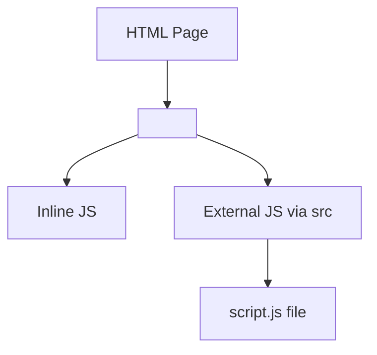

# 📜 Adding JavaScript to HTML — `<script>` Tag

## 🧾 Introduction

To bring JavaScript into your web page, you use the `<script>` tag. It's how you tell the browser:  
**"Here comes the code that makes this page smart!"**

> ✅ JavaScript can be added **inline** or from an **external file**.

---

## 🧩 Syntax: Inline Script

You can write JavaScript **directly inside** the HTML using `<script>`:

```html
<!DOCTYPE html>
<html>
<head>
  <title>JS Example</title>
</head>
<body>
  <h1>Hello!</h1>
  
  <script>
    alert('Welcome to the page!');
  </script>
</body>
</html>
````

> 🧠 This is called an **inline script**.

---

## 📁 Syntax: External Script

To keep code clean and reusable, we usually put JS in **external files**:

```html
<script src="script.js"></script>
```

📂 Folder structure example:

```
/project
  ├── index.html
  └── script.js
```

```js
// script.js
console.log("JavaScript Loaded!");
```

> 🔄 External scripts make your code **modular and maintainable**.

---

## 🏷️ Are `type` and `language` attributes required?

**❌ No!** In modern HTML5:

* You don’t need `type="text/javascript"` ✅
* You don’t need `language="JavaScript"` ✅

```html
<!-- This is enough -->
<script src="app.js"></script>
```

> ⚠️ `type` was used in older HTML. It's now optional because JS is the default.

---

## ⚙️ Best Practices

✅ Place `<script>` tags:

* **At the end of the body** (to avoid blocking rendering)
* Or use `defer`/`async` attributes if in `<head>`

```html
<script src="main.js" defer></script> <!-- Loads in parallel, runs after HTML -->
```

---

## 📌 Summary Table

| 🧠 Concept           | ✅ Best Practice / Info                     |
| -------------------- | ------------------------------------------ |
| Inline Script        | `<script> JS here </script>`               |
| External Script      | `<script src="file.js"></script>`          |
| `type` attribute     | Optional in HTML5 ✅                        |
| `language` attribute | Deprecated ❌                               |
| Best place to load   | End of body OR use `defer` ✅               |
| Reusability          | External files preferred for modularity 🧱 |

---

## 🧠 Interview Tip

> **Q: Why place `<script>` at the end of `<body>`?**
> **A:** To prevent JS from blocking HTML rendering. Or use `defer` in `<head>`.

---

## 📸 Visual Summary



---


