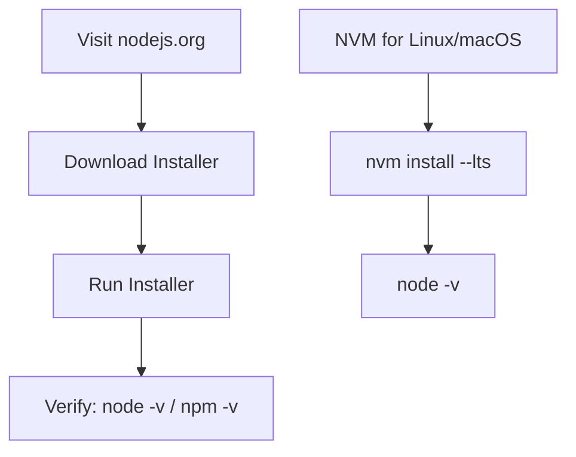

# ⚙️ How to Install, Reinstall & Update Node.js

## 🌐 Official Node.js Website

👉 Visit the official website:  
🔗 [https://nodejs.org](https://nodejs.org)

You’ll see two versions:
- **LTS (Long-Term Support)** — ✅ **Recommended for most users**
- **Current** — for those who want the latest features

---

## 🧱 Method 1: Install Node.js Manually (One-Time)

1. Go to [https://nodejs.org](https://nodejs.org)
2. Download the **LTS version** for your OS:
   - `.msi` for Windows
   - `.pkg` for macOS
   - Binary or installer for Linux
3. Follow the setup wizard ➡️ Finish installation

✅ Done! Now verify:

```bash
node -v
npm -v
````

---

## 🔁 Method 2: Install via NVM (Node Version Manager)

**Best for developers who switch between Node versions.**

### 🧑‍💻 On macOS/Linux:

1. Install NVM:

```bash
curl -o- https://raw.githubusercontent.com/nvm-sh/nvm/v0.39.7/install.sh | bash
```

2. Restart terminal and verify:

```bash
nvm --version
```

3. Install Node.js:

```bash
nvm install --lts
nvm use --lts
```

4. Check:

```bash
node -v
npm -v
```

---

## 💡 Method 3: On Windows (with NVM for Windows)

1. Go to: [https://github.com/coreybutler/nvm-windows](https://github.com/coreybutler/nvm-windows)
2. Download latest `.exe` from **Releases**
3. Install and then run:

```bash
nvm install lts
nvm use lts
```

✅ Switch Node versions easily using:

```bash
nvm list
nvm use <version>
```

---

## 🔄 Reinstall or Update Node.js

### ✅ Method A: Manual Update

* Go to [https://nodejs.org](https://nodejs.org)
* Download the latest version
* Install it — it **replaces** the old version automatically

### ✅ Method B: With NVM

```bash
nvm install <new-version>    # e.g., nvm install 20
nvm use <new-version>
```

You can also uninstall old versions:

```bash
nvm uninstall <old-version>
```

---

## 🖼️ Visual Summary



---

## 🧠 Interview Tip

> Q: How do you manage multiple Node versions in a project?
> A: Use **NVM** to switch between versions as per project needs.

---

## 📌 Summary Table

| 💡 Task               | ✅ Command or Action                  |
| --------------------- | ------------------------------------ |
| Check Node version    | `node -v`                            |
| Check NPM version     | `npm -v`                             |
| Install Node (manual) | Download from nodejs.org             |
| Install via NVM       | `nvm install --lts`                  |
| Switch Node version   | `nvm use <version>`                  |
| Reinstall/Update Node | Reinstall from site or `nvm install` |

---


---


