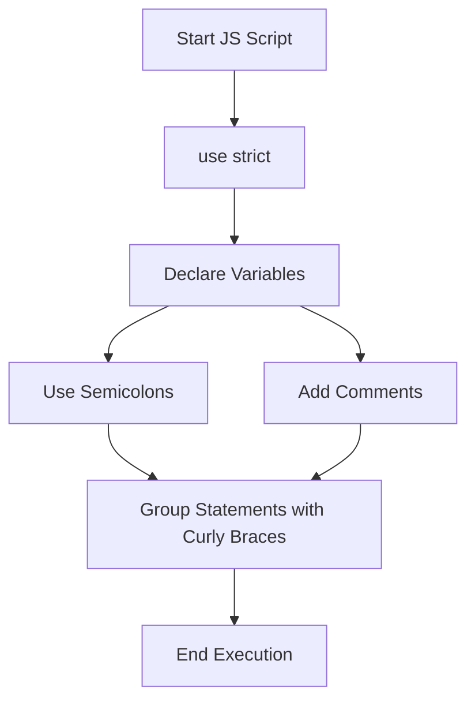

# ✏️ JavaScript Syntax — Basics & Common Mistakes

## 📌 Overview

Even the best developers started with small bugs caused by forgotten semicolons or misplaced comments. Here’s your **clean cheat sheet** to avoid common beginner issues in JavaScript.

---

## 🔸 1. Semicolons `;`

### ✅ Are they required?
- Technically **optional** due to **Automatic Semicolon Insertion (ASI)** in JavaScript.
- But it's **highly recommended** to use them to avoid unexpected behavior!

### ❌ Common mistake:

```js
// Without semicolon - risky
let a = 10
let b = 20
console.log(a + b)
````

### ✅ Best practice:

```js
let a = 10;
let b = 20;
console.log(a + b);
```

---

## 🗒️ 2. Comments in JS

### ✍️ Single-line comment:

```js
// This is a single-line comment
let age = 25;
```

### 📚 Multi-line comment:

```js
/* 
  This is a multi-line comment.
  It can span multiple lines.
*/
let name = "John";
```

---

## ⚠️ 3. Statements & Code Blocks

Every line of executable code is a **statement**. Use `{}` to group multiple statements into a **block**.

### ✅ Example:

```js
if (true) {
  console.log("This is a block");
}
```

### ❌ Mistake: forgetting `{}` in conditionals with multiple lines

```js
// Only the first line is considered inside the if-statement
if (true)
  console.log("Line 1");
  console.log("Line 2"); // ← runs outside the if block!
```

---

## 🔐 4. The Modern Mode: `"use strict"`

> `"use strict"` tells the browser: **“Run this JavaScript with more discipline.”**

---

## 🧪 What it does

When added at the top of your script or function, it:

* ❌ Disallows using **undeclared variables**
* ❌ Throws errors for **assigning to read-only properties**
* ❌ Prevents using **reserved keywords** like `eval` or `arguments` incorrectly
* ✅ Makes it easier to **write secure, predictable code**

---

## 📅 History

* Introduced in **ECMAScript 5 (2009)**
* Created to fix **loose behavior** in older JavaScript

```js
"use strict";

x = 10;  // ❌ Error: x is not defined
```

Without `"use strict"`:

```js
x = 10;  // ✅ Allowed, but creates a global variable — risky!
```

---

## 🧠 Common Mistake

Strict mode is **function-scoped** too! If added **inside a function**, it only affects that function:

```js
function test() {
  "use strict";
  y = 5;  // ❌ Error only here
}
```

---

## ✅ Is it still recommended today?

Yes, but with a twist:

### 🧙‍♂️ Modern JavaScript (ES6 modules):

* Automatically runs in strict mode
* So `"use strict"` is **not needed** in `.mjs` or inside `type="module"` scripts

```html
<script type="module">
  // Already in strict mode!
</script>
```

✅ Still, if you're writing classic `.js` files or scripts without modules, **adding `"use strict"` is good practice**.

---

## 🧠 Interview Tip

> Q: Do we still need `"use strict"` today?

**A:** If you're using **ES6 modules**, strict mode is default. Otherwise, it's still helpful for catching silent bugs and enforcing best practices.

---

## ⚖️ Comparison Table

| Behavior                   | Without Strict | With `"use strict"` |
| -------------------------- | -------------- | ------------------- |
| Undeclared variables       | ✅ Allowed      | ❌ Throws Error      |
| Duplicated parameter names | ✅ Allowed      | ❌ Syntax Error      |
| Assign to read-only props  | ✅ Silent fail  | ❌ Throws Error      |
| Secure & clean coding      | ❌ No help      | ✅ Encouraged        |

---


## 🖼️ Visual Syntax Flow


```
