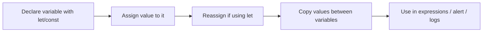

# 📦 JavaScript Variables — Real-Life Explained

## 🔰 What is a Variable?

> Think of a **variable** as a labeled **box** 📦 where you store data. The name on the box helps you find and reuse the data.

---

### 🎯 Real-Life Analogy:
- 🏷️ You have a box labeled **message**.
- Inside it, you put a note: **"Hello!"**
- Later, you take out that note and put a new one: **"World!"**

```js
let message;      // Declare the box
message = "Hello!"; // Put "Hello!" in it
message = "World!"; // Replace with "World!"
alert(message);   // Output: World!
````

---

## 🔄 Declaring, Assigning & Reassigning

### 📌 Declare:

```js
let username;
```

A box is created — **empty** for now.

### ✅ Assign:

```js
username = "John";
```

Now the box contains the data "John".

### 🔁 Reassign:

```js
username = "Mike";
```

You replaced the content — old value is gone.

---

## 📥 Copying Between Variables

```js
let hello = "Hello world!";
let message;
message = hello;

alert(hello);   // Hello world!
alert(message); // Hello world!
```

🧠 **Both boxes now have the same content, but they are separate boxes.**

---

## ❌ Common Mistakes

### 🔹 Using undeclared variables:

```js
message = "Hi"; // ❌ Error in strict mode!
```

Always declare first using `let`, `const`, or `var` (best: `let` or `const`).

### 🔹 Redeclaring with `let` in the same scope:

```js
let user = "John";
let user = "Mike"; // ❌ SyntaxError
```

Use a **new name** or reassign:

```js
user = "Mike"; // ✅
```

---

## 🧠 Best Practice: Use `let` and `const`

* Use `const` when value shouldn't change.
* Use `let` when it will change.
* Avoid `var` — it has outdated behavior.

```js
const pi = 3.14;
let age = 25;
age = 26; // ✅
```

---

## 🧩 Naming Variables

### ✅ Good Names:

```js
let userName = "Alice";
let totalPrice = 200;
```

### ❌ Bad Names:

```js
let x = "Alice";      // Unclear
let data = 200;       // Too generic
```

---

### 🧠 Memory Trick:

Use **camelCase** for variables:

* ✅ `firstName`, `totalAmount`, `isLoggedIn`

Imagine you're naming **folders** on your desktop. Name them so anyone (including future-you) can understand them.

---

## 🧠 Interview Insight

> Q: What's the difference between `let`, `const`, and `var`?

**A:** `const` is for constants (can't reassign), `let` is for block-scoped variables, and `var` is function-scoped (not recommended in modern code).

---

## 🖼️ Visual Reference



---

## 🧪 Quick Review Table

| Action       | Syntax          | Notes                          |
| ------------ | --------------- | ------------------------------ |
| Declare      | `let a;`        | Creates a variable             |
| Assign       | `a = 10;`       | Sets a value                   |
| Reassign     | `a = 20;`       | Changes existing value         |
| Copy         | `b = a;`        | b now holds a's value          |
| Best Keyword | `let` / `const` | Use `const` if not reassigning |

---

🧠 **Summary:** Variables are the building blocks of JavaScript. Treat them like labeled containers and name them with care. Good naming helps avoid bugs and makes your code readable.


