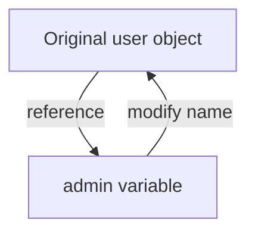
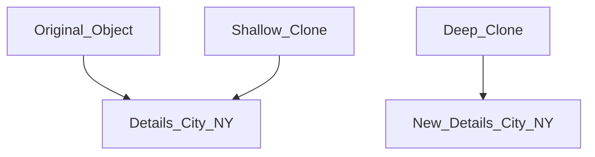

# 📊 JavaScript Data Types - Explained Clearly

In JavaScript, data types define the kind of data a variable can hold. Understanding them is essential for building reliable and bug-free applications.

---

## 🔹 Primitive vs Reference Types

| Type           | Category     | Example            | Mutable |
|----------------|--------------|--------------------|---------|
| `String`       | Primitive    | `"Hello"`          | ❌      |
| `Number`       | Primitive    | `42`, `3.14`       | ❌      |
| `Boolean`      | Primitive    | `true`, `false`    | ❌      |
| `undefined`    | Primitive    | `let x;`           | ❌      |
| `null`         | Primitive    | `null`             | ❌      |
| `Symbol`       | Primitive    | `Symbol("id")`     | ❌      |
| `BigInt`       | Primitive    | `1234567890123n`   | ❌      |
| `Object`       | Reference    | `{ name: "John" }` | ✅      |
| `Array`        | Reference    | `[1, 2, 3]`        | ✅      |
| `Function`     | Reference    | `function() {}`    | ✅      |

---

## 🧠 Primitive Types – Stored by Value

```js
let a = "Hello";
let b = a;
b = "World";

console.log(a); // Hello
```

✅ Each variable holds its own independent copy.

---

## 🧠 Reference Types – Stored by Reference

```js
let user = { name: "Alice" };
let admin = user;
admin.name = "Bob";

console.log(user.name); // Bob
```

❗ `user` and `admin` both refer to the **same object**.

---

## 📈 Mermaid Diagram – Reference Sharing



---

## 🔄 Cloning Objects

### 🔹 Shallow Clone Example

```js
let user = {
  name: "John",
  details: { city: "NY" }
};

let clone = Object.assign({}, user);
clone.details.city = "LA";

console.log(user.details.city); // LA ❌
```

### 🔹 Deep Clone Example

```js
let user = {
  name: "John",
  details: { city: "NY" }
};

let clone = structuredClone(user);
clone.details.city = "LA";

console.log(user.details.city); // NY ✅
```

---

## 📈 Mermaid Diagram – Shallow vs Deep Clone



---

## ✅ Const and Object Mutability

```js
const user = { name: "John" };
user.name = "Pete"; // ✅ allowed

user = {}; // ❌ Error: Assignment to constant variable
```

📌 `const` prevents reassignment, but internal object values can still change.

---

## 🛠️ Real Life Analogy

Imagine a TV remote (variable) that controls a TV (object).  
If you give the remote to someone else (copy the reference), they can also change the channel (mutate the object).

---

## 🏁 Summary

* ✅ **Primitives** are copied **by value**
* ✅ **Objects** are copied **by reference**
* ⚠️ Use `structuredClone()` or libraries like `lodash` for deep cloning
* 📌 `const` on an object means the reference can’t change, not the contents

---

# 🧭 Browser Interaction Methods in JavaScript

JavaScript offers **three built-in functions** to interact directly with users via the browser.

---

## 🔔 1. `alert()`

- Displays a **simple modal message**
- Blocks page execution until the user presses “OK”
- Returns `undefined`

### ✅ Example:

```js
alert("Welcome to our site!");
```

---

## ✍️ 2. `prompt()`

- Asks the user to **input text**
- Returns the entered string or `null` if canceled

### ✅ Example:

```js
let userName = prompt("What's your name?", "Guest");
alert(`Hello, ${userName}`);
```

---

## ✅ 3. `confirm()`

- Asks the user to **confirm an action**
- Returns `true` if OK is clicked, `false` otherwise

### ✅ Example:

```js
let isSure = confirm("Do you really want to delete this item?");
if (isSure) {
  alert("Item deleted.");
} else {
  alert("Action canceled.");
}
```

---

## ⏳ Modal Behavior

All three methods are **modal**:

* They **pause script execution** until the dialog is closed.
* The rest of the webpage becomes unclickable until the user responds.

---

## ⚠️ Limitations

| Limitation             | Description                                                      |
|------------------------|------------------------------------------------------------------|
| Layout/Styling Control | You **cannot customize** how the modal looks or where it appears |
| User Experience        | Modals can be **disruptive** to users                            |
| Modern Alternatives    | Use custom modals (e.g., **SweetAlert2**, **Bootstrap modals**)  |

---

## 📌 Summary Table

| Function    | Purpose             | Return Value       | Accepts Input |
|-------------|---------------------|--------------------|----------------|
| `alert()`   | Display a message   | `undefined`        | ❌             |
| `prompt()`  | Get text input      | `string` or `null` | ✅             |
| `confirm()` | Yes/No confirmation | `true` or `false`  | ✅             |

---

## 🔄 Real-Life Use Cases

| Function    | Example Use Case                                        |
|-------------|---------------------------------------------------------|
| `alert()`   | Notify user of a successful form submission             |
| `prompt()`  | Ask for a name before starting a chat or quiz           |
| `confirm()` | Confirm deletion of data or navigation away from a page |

