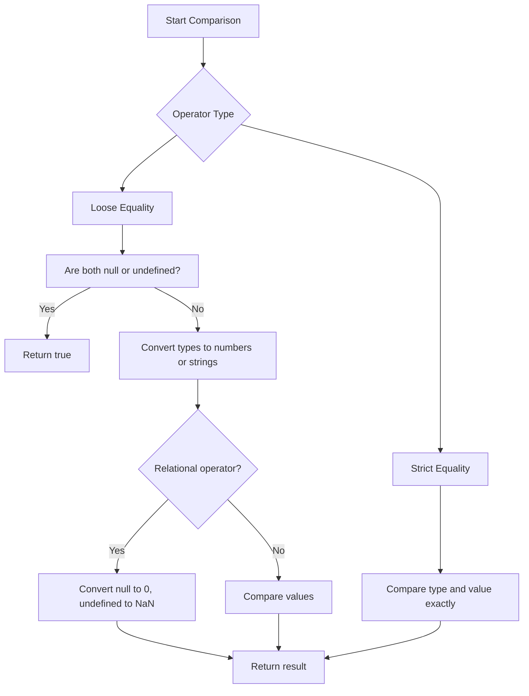

# JavaScript Comparison Operators — Detailed Notes & Memorization Guide

---

## 🔍 Overview of Comparison Operators

Comparison operators in JavaScript return a **boolean** value (`true` or `false`). They are commonly used to compare values and control the flow of programs.

- When comparing **strings**, JavaScript compares them **letter-by-letter** based on Unicode values (like dictionary order but case-sensitive).
- When comparing **different types** (except with strict equality `===`), JavaScript attempts **type coercion** to convert values to numbers before comparison.
- Special attention is needed when comparing **`null`** and **`undefined`** as they have unique behaviors.

---

## 1️⃣ Basic Behavior of `null` and `undefined`

| Expression          | Result | Explanation                          |
|---------------------|---------|------------------------------------|
| `null == undefined` | `true`  | They are loosely equal only to each other. |
| `null === undefined`| `false` | Strict equality fails because types differ. |
| `null == 0`         | `false` | `null` does NOT equal zero!         |
| `undefined == 0`    | `false` | `undefined` is NOT coerced to zero.|
| `null < 1`          | `true`  | In relational ops, `null` behaves like 0.|
| `undefined < 1`     | `false` | `undefined` converts to NaN, always false.|

**Note:** Always check explicitly for `null` or `undefined` when these values can appear, to avoid unexpected behavior.

---

## 2️⃣ Strict Equality (`===`) vs Loose Equality (`==`)

| Operator  | Behavior                                                      |
|-----------|---------------------------------------------------------------|
| `===`     | Checks equality **without type coercion** — types and values must match exactly. |
| `==`      | Checks equality **with type coercion** — converts values to common type before comparing. |

### Examples:

```js
0 == false      // true (type coercion)
0 === false     // false (different types)
"5" == 5       // true (string converted to number)
"5" === 5      // false
null == undefined // true
null === undefined // false
````

---

## 3️⃣ Comparing Different Types

When using `<`, `>`, `<=`, `>=`, JavaScript converts values to numbers (except strings compared to strings).

```js
'2' > '12'    // true because string comparison compares first character: '2' > '1'
'2' > 12      // false because '2' → 2, 2 > 12 → false
```

---

## 4️⃣ The Strange Case of `NaN`

* `NaN` stands for “Not a Number”.
* **Any comparison with `NaN` returns `false`**, including `NaN === NaN`.
* To check for `NaN`, use `Number.isNaN(value)`.

```js
NaN === NaN         // false
Number.isNaN(NaN)   // true
```

---

## 5️⃣ Summary Table for `null` and `undefined`

| Comparison Expression | Result | Explanation                                   |
| --------------------- | ------ | --------------------------------------------- |
| `null == undefined`   | true   | Only loosely equal to each other.             |
| `null === undefined`  | false  | Different types, strict equality fails.       |
| `null == 0`           | false  | Null does NOT equal zero.                     |
| `null < 1`            | true   | Relational operator converts null to zero.    |
| `undefined == 0`      | false  | Undefined NOT equal to zero.                  |
| `undefined < 1`       | false  | Undefined converts to NaN → comparison false. |

---

## 6️⃣ String Comparisons

* Strings are compared **character by character** using Unicode code points.
* Uppercase letters come before lowercase letters (e.g., `'Z' < 'a'`).

```js
'Apple' < 'Banana'    // true
'2' > '12'            // true, because '2' > '1' lex order
```

---

# 🧠 Memorization Guide for JavaScript Comparisons

---

### 1️⃣ Null and Undefined — The Odd Couple

| Fact                          | Memory Trick                                             |
| ----------------------------- | -------------------------------------------------------- |
| `null == undefined` is true   | **"Null & Undefined are best friends"** (only with `==`) |
| `null === undefined` is false | They look alike but aren't twins (strict equality fails) |

---

### 2️⃣ Null’s Behavior in Comparisons

| Fact                               | Memory Trick                                                 |
| ---------------------------------- | ------------------------------------------------------------ |
| `null` behaves like `0` in `<`/`>` | Think **Null is Zero’s undercover agent** for relational ops |
| But `null == 0` is false           | Null doesn’t reveal its true identity in equality checks     |

---

### 3️⃣ Undefined in Comparisons

| Fact                                                    | Memory Trick                                                 |
| ------------------------------------------------------- | ------------------------------------------------------------ |
| `undefined` converts to `NaN` in `<`/`>` (always false) | **Undefined is NaN’s evil twin** — it breaks all comparisons |
| `undefined == 0` is false                               | Undefined doesn’t play with numbers                          |

---

### 4️⃣ Strict Equality (`===`)

| Fact                    | Memory Trick                                 |
| ----------------------- | -------------------------------------------- |
| No type coercion at all | **"Triple equals: exact match or no match"** |

---

### 5️⃣ NaN is Special

| Fact                          | Memory Trick                                                   |
| ----------------------------- | -------------------------------------------------------------- |
| `NaN === NaN` is false        | **"NaN is a lone wolf, never equals anyone, not even itself"** |
| Use `Number.isNaN()` to check | Like a detective with a magnifying glass                       |

---

### 6️⃣ String Comparison Order

| Fact                                    | Memory Trick                        |
| --------------------------------------- | ----------------------------------- |
| Letters compared by Unicode order       | **"Dictionary, but Unicode style"** |
| Uppercase letters come before lowercase | Remember: 'Z' < 'a' (90 < 97)       |

---

### Quick Summary Mnemonic:

**NUD SNaK**

* **N**ull and **U**ndefined: best friends (`==`) but not twins (`===`)
* **D**angerous `null` acts like **0** in `<` and `>`
* **S**trict equality is **n**o type coercion
* **NaK**: NaN is a loner, never equals itself

---

### Bonus Tip:

When you see `==`, ask:

* Are these `null` and `undefined`?
* Or different types needing coercion?

When in doubt, **always use `===`** to keep things predictable!

---

# Visual Overview (Mermaid Diagram)



---

# Interview Tips:

* Always clarify whether to use `==` or `===`.
* Explain why `null` and `undefined` behave differently in comparisons.
* Demonstrate knowledge of `NaN` quirks and how to test it properly.
* Be aware of how strings compare lexicographically.
* Show awareness of implicit type coercion dangers.

---

# Summary

Understanding JavaScript’s comparison operators requires knowing:

* When coercion happens and when it doesn't.
* How `null` and `undefined` interact (and where they break rules).
* That `NaN` is unique and must be checked explicitly.
* String comparisons are lex order, not numeric order.

Keep the **NUD SNaK** mnemonic handy to remember the tricky parts!

---


