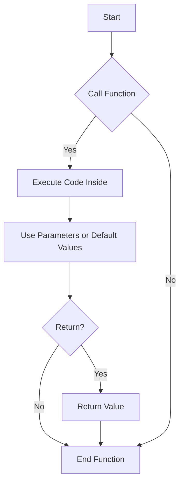

# 📘 Function Basics in JavaScript

## 🧠 What is a Function?
A function is a block of code designed to perform a particular task. It runs only when called.

---

## 🔤 Syntax of a Function Declaration
```js
function functionName(parameters) {
  // code to execute
  return value; // optional
}
```

---

## 🔁 Example: Simple Function
```js
function greet(name) {
  return `Hello, ${name}!`;
}

console.log(greet("John")); // Hello, John!
```

---

## 📍 Local Variables
Variables declared inside a function are **local** to that function.
```js
function showMessage() {
  let message = "Hello, local variable!";
  console.log(message);
}

showMessage();
```

---

## 🌍 Outer Variables (Closure)
A function can access variables outside of it.
```js
let user = "Alice";

function greetUser() {
  console.log("Hello, " + user);
}

greetUser();
```

---

## 📦 Parameters and Arguments
Functions can take parameters which behave like local variables.
```js
function sum(a, b) {
  return a + b;
}

console.log(sum(3, 4)); // 7
```

---

## 🎯 Default Values
You can assign default values to parameters.
```js
function greet(name = "Guest") {
  console.log("Hello, " + name);
}

greet(); // Hello, Guest
greet("Sam"); // Hello, Sam
```

---

## 🔙 Returning a Value
Functions can return a result using `return`.
```js
function multiply(a, b) {
  return a * b;
}

let result = multiply(2, 5);
console.log(result); // 10
```

---

## 🏷 Naming a Function
Use camelCase. Function names should describe what they do.
Examples: `getUser()`, `calculateSum()`, `showMessage()`

---

## 📊 Summary Table
| Concept             | Description                                           | Example                          |
|---------------------|-------------------------------------------------------|----------------------------------|
| Function Declaration| Declares a named function                            | `function sum(a, b) {}`          |
| Local Variable      | Defined within the function                          | `let msg = "Hi";`                |
| Outer Variable      | Accesses variable from outer scope                   | `let user = "Tom";`              |
| Parameters          | Inputs to function                                   | `sum(a, b)`                      |
| Default Values      | Assigns default when no argument is passed           | `name = "Guest"`                |
| Return Value        | Outputs a result from the function                   | `return a + b;`                  |

---

## 🧠 Visualization


---

Let me know if you'd like practice questions, cheat sheets, or flashcard-style notes! 🚀
