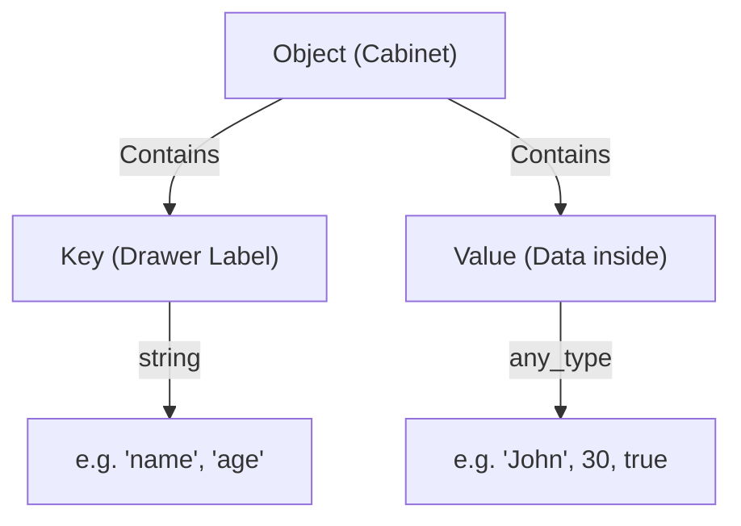
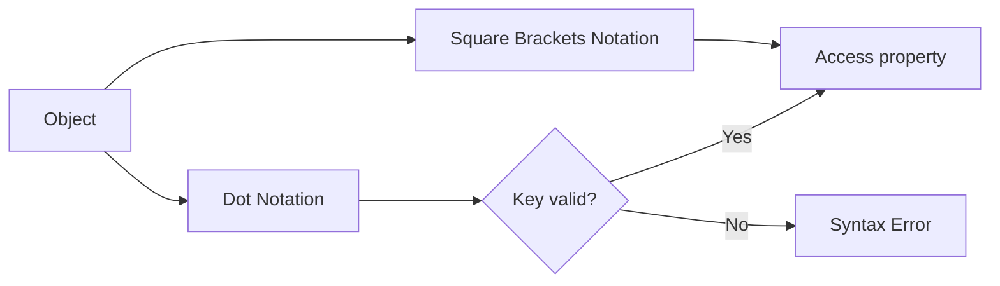
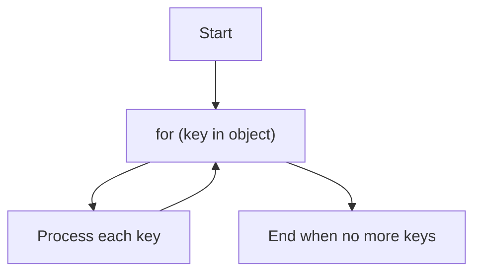

# 📦 JavaScript Objects — In-Depth Explanation

---

## What is an Object? 🧐

JavaScript objects are **collections of key-value pairs** used to store more complex data than primitive types like strings or numbers.

> **Think of an object as a cabinet with labeled drawers (keys), where each drawer contains some data (value).**

---

### Primitive vs Object

| Data Type         | Description                          |
|-------------------|------------------------------------|
| **Primitive**     | Stores a single simple value (string, number, boolean, etc.) |
| **Object**        | Stores multiple values as properties with keys |

---

## Creating Objects 🏗️

### Object Literal Syntax (Most common)

```js
let user = {
  name: "John",
  age: 30
};
````

### Object Constructor Syntax

```js
let user = new Object();
```

---

## Object Structure & Properties 🔑

An **object property** is a key-value pair:

```js
let user = {
  name: "John", // key: name, value: "John"
  age: 30       // key: age, value: 30
};
```

| Property | Key Type | Value Type          |
| -------- | -------- | ------------------- |
| Key      | String   | Any data type       |
| Value    | Any      | Primitive or Object |

---

## Accessing Properties 👀

### Dot Notation

```js
alert(user.name);  // "John"
```

### Square Brackets Notation (For complex keys)

```js
alert(user["age"]); // 30
```

---

## Adding & Removing Properties ➕

```js
user.isAdmin = true;   // Add
delete user.age;       // Remove
```

---

## Real-life Analogy: Filing Cabinet 🗄️

* Object = Cabinet
* Property Key = Drawer label
* Property Value = Documents inside the drawer

You can open any drawer (access property), add new files (add properties), or remove files (delete properties) easily.

---

## Multiword & Special Character Keys 📝

Keys with spaces or special characters **must be quoted** and accessed via square brackets:

```js
let user = {
  "likes birds": true
};

alert(user["likes birds"]); // true
```

---

## Why Use Square Brackets? 🤔

* Dot notation works only for keys that are valid identifiers (no spaces, no special chars, no starting with digits).
* Square brackets accept any string or expression.

---

## Computed Property Names ⚡

You can dynamically create property names using square brackets:

```js
let fruit = "apple";

let bag = {
  [fruit]: 5 // property name is "apple"
};

alert(bag.apple); // 5
```

---

## Property Value Shorthand ✂️

When variable names and property names match, you can use shorthand:

```js
function makeUser(name, age) {
  return { name, age };
}

let user = makeUser("John", 30);
alert(user.name); // John
```

---

## Property Names: No Restrictions! 🚫

Unlike variables, property names can be:

* Reserved keywords (`for`, `let`, `return`)
* Numbers (converted to strings)
* Strings or Symbols

Example:

```js
let obj = {
  for: 1,
  let: 2,
  return: 3,
  0: "zero"
};

alert(obj.for + obj[0]); // 1zero (0 is converted to "0")
```

---

## Special Case: `__proto__` ⚠️

Assigning a non-object value to `__proto__` is ignored:

```js
let obj = {};
obj.__proto__ = 5;
alert(obj.__proto__); // [object Object]
```

---

## Checking Property Existence ✅

* Accessing missing property returns `undefined`.
* Use the `"key" in object` operator for reliable check:

```js
let user = { name: "John" };

alert("name" in user); // true
alert("age" in user);  // false
```

---

## Why `"in"` Operator? 🤷‍♂️

If a property exists but has value `undefined`, checking via `obj.prop === undefined` can be misleading:

```js
let obj = { test: undefined };

alert(obj.test === undefined); // true — looks like missing
alert("test" in obj);          // true — property exists
```

---

## Looping Over Object Properties 🔄

Use the `for...in` loop to iterate over keys:

```js
let user = { name: "John", age: 30, isAdmin: true };

for (let key in user) {
  alert(key + ": " + user[key]);
}
```

---

## Are Objects Ordered? 📋

* Integer-like keys are iterated in **ascending numeric order**.
* Non-integer keys follow **creation order**.

Example:

```js
let codes = {
  "49": "Germany",
  "41": "Switzerland",
  "44": "Great Britain",
  "1": "USA"
};

for (let code in codes) {
  alert(code); // 1, 41, 44, 49
}
```

---

## Integer Properties Explained 🔢

A string key is "integer" if it can be converted to an integer without change.

```js
alert(String(Math.trunc(Number("49"))));   // "49" (integer)
alert(String(Math.trunc(Number("+49"))));  // "49" but "+49" ≠ "49", so NOT integer
alert(String(Math.trunc(Number("1.2"))));  // "1" but "1.2" ≠ "1", NOT integer
```

---

## Fixing Ordering with Non-Integer Keys 🚀

Add a prefix to force non-integer keys:

```js
let codes = {
  "+49": "Germany",
  "+41": "Switzerland",
  "+44": "Great Britain",
  "+1": "USA"
};

for (let code in codes) {
  alert(code); // +49, +41, +44, +1 (creation order)
}
```

---

## Visualization with Mermaid Diagrams 🗺️

### Object Structure Flowchart



---

### Accessing Object Properties



---

### Property Iteration: for...in loop



---

# Summary 📝

* Objects store keyed collections of data.
* Use `{}` or `new Object()` to create objects.
* Properties are accessed by dot or square brackets.
* Square brackets allow dynamic and complex keys.
* Use `in` to check property existence safely.
* Use `for...in` to loop over properties.
* Property ordering depends on key types (integer vs non-integer).

