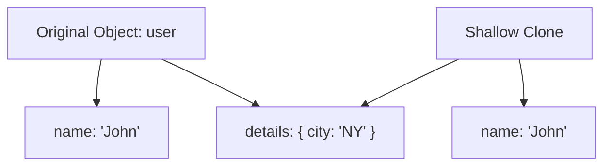
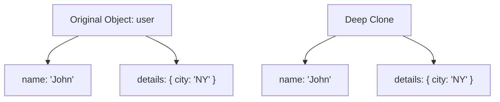

## 📦 JavaScript Object References vs Copying

In JavaScript, a key difference exists between how **primitive values** and **objects** are stored and copied. Let’s explore the problem, best practices, and solutions — with visual aids.

---

## ❗ The Problem: Reference vs Value

- **Primitives** like `number`, `string`, `boolean` are **copied by value**.
- **Objects** are **copied by reference**, not as independent copies.

---

## 🔍 Real Example: Problem with Object Reference

```js
let user = { name: "John" };
let admin = user;

admin.name = "Pete";
console.log(user.name); // 👉 "Pete"
````

Both `user` and `admin` point to the same object in memory.

---

## 🎯 Why It's a Problem

* 🐛 Unexpected changes across variables
* 🧩 Bugs from accidental shared state
* 🔍 Hard-to-debug data leaks

---

## 🧭 Shallow Copy Visualization



🔁 `user.details` is **shared** with `clone.details`

---

## 🔁 Deep Copy Visualization



✅ `user.details` and `clone.details` are **completely separate**

---

## 🛠️ Copying Techniques

### 1. ✨ Shallow Copy

```js
let clone = { ...user };
// or
let clone = Object.assign({}, user);
```

* ✅ Good for flat objects
* ❌ Fails on nested data

---

### 2. 💡 Deep Copy with `structuredClone()`

```js
let clone = structuredClone(user);
```

* ✅ Supports nested structures
* ✅ Handles circular references
* ❌ Cannot clone functions

---

### 3. 🔧 Deep Copy with `lodash`

```bash
npm install lodash
```

```js
import cloneDeep from 'lodash/cloneDeep';
let clone = cloneDeep(user);
```

* ✅ Handles functions, nested objects, and circular references

---

## 📊 Comparison Table

| Method               | Deep? | Circular Support | Function Support | Use Case                 |
| -------------------- | ----- | ---------------- | ---------------- | ------------------------ |
| `{ ...obj }`         | ❌     | ❌                | ✅                | Flat object copy         |
| `Object.assign()`    | ❌     | ❌                | ✅                | Flat object copy         |
| `structuredClone()`  | ✅     | ✅                | ❌                | Safe deep clone (modern) |
| `lodash.cloneDeep()` | ✅     | ✅                | ✅                | Full deep clone (robust) |

---

## 🧠 Real-Life Use Case

Imagine cloning a user profile before editing:

```js
function updateUser(original) {
  let copy = structuredClone(original);
  copy.name = "Updated";
  return copy;
}
```

* 🎯 Ensures original data stays intact
* 🧼 Safe for nested values

---

## ✅ Best Practice Summary

| Situation                         | Best Method                       |
| --------------------------------- | --------------------------------- |
| Flat object                       | `{ ...obj }` or `Object.assign()` |
| Deep nested, no functions         | `structuredClone()`               |
| Deep with functions/circular refs | `_.cloneDeep()`                   |

---

> 📌 Always use **deep clone** for nested structures to avoid side effects.
> 📎 Use modern native tools when possible (`structuredClone`) for better performance and clarity.

```
```
