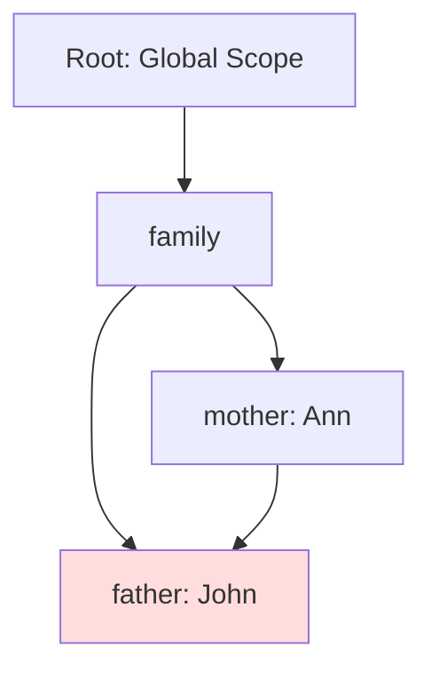
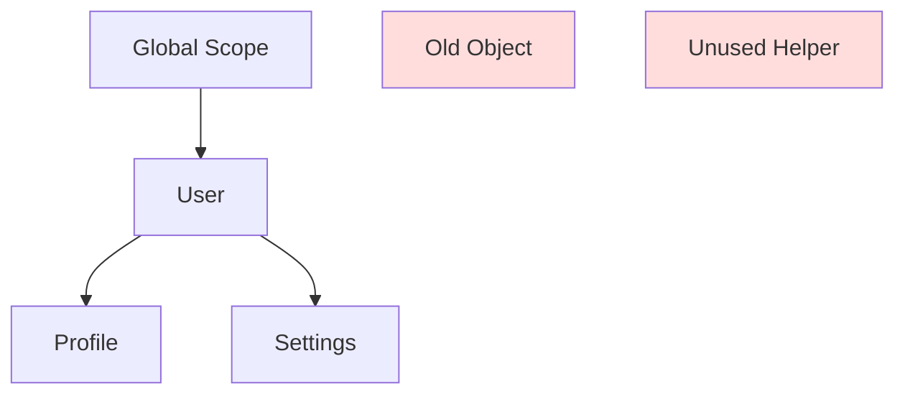

# 🧹 JavaScript Garbage Collection – Explained Visually and Intuitively

Memory in JavaScript is managed automatically. But how does the engine decide **what to keep** and **what to delete** from memory?

This guide breaks it down with code, real-life analogies, and diagrams.

---

## 📦 What is Garbage Collection?
Garbage collection (GC) is a process in JavaScript engines that **automatically frees up memory** by removing objects that are **no longer reachable**.

Think of memory like your phone’s photo gallery — you delete old or unused pictures to make space for new ones. JavaScript does this automatically for variables and objects.

---

## 🧭 Reachability – The Core Concept

An object is considered **reachable** if it can be accessed in some way, starting from the **roots**:

### 🧱 Roots Include:
- Currently executing functions
- Local variables and parameters
- Global variables

Everything else is reachable if there’s a **path of references** from a root.

### 📌 Example 1 – A Simple Object
```js
let user = {
  name: "John"
};

user = null; // The object becomes unreachable
```

✅ The object was in memory while `user` pointed to it. Once we assigned `null`, the reference was lost — the object becomes unreachable and is removed.

### 🎯 Real-Life Analogy:
A note stuck on your fridge (object). Once you remove it (nullify reference), it’s trash (GC).

---

## 🧑‍🤝‍🧑 Two References – Still Reachable
```js
let user = { name: "John" };
let admin = user;

user = null; // ❌ Still reachable via admin
```

✅ Although `user` is null, `admin` still references the object.

### 🎯 Analogy:
Two roommates (user and admin) share the same remote (object). One stops using it, but the other still uses it — so it’s not thrown away.

---

## 🔗 Interlinked Objects – Mutual References

### 📌 Example 2 – Married Couple
```js
function marry(man, woman) {
  woman.husband = man;
  man.wife = woman;

  return {
    father: man,
    mother: woman
  };
}

let family = marry({ name: "John" }, { name: "Ann" });
```

✅ All objects are reachable through the `family` object.

### ❌ Removing Links
```js
delete family.father;
delete family.mother.husband; // Removes link to father
```

After this, **John** is no longer reachable if no other variable points to him.

### 🎯 Analogy:
If a couple loses their shared contact info and no one else remembers them, they’re forgotten — like unlinked memory.

---

## 🌐 Mermaid Diagram – Reference and Garbage


---

## 🏝️ Unreachable Island
Even if objects refer to each other, if there’s **no external reference** to them, they are garbage.

### 📌 Example 3 – Island Removed
```js
family = null; // Entire structure becomes unreachable
```

### 🎯 Analogy:
An island (object cluster) is connected to the mainland (global variable). Cutting the bridge (reference) strands it — no one can reach it, so it's cleared.

---

## 🧠 How It Works: Mark and Sweep

### Steps:
1. **Mark** roots (global, local vars)
2. Follow references and mark those too
3. Repeat until all reachable items are marked
4. **Sweep** unmarked (unreachable) objects — delete them

### 📈 Mermaid Diagram – Mark and Sweep


Objects `X` and `Y` are unreachable — they'll be deleted.

---

## 🧪 Code Example – Garbage Collection Trigger
```js
function createUser() {
  let user = {
    name: "Alice",
    age: 30
  };
  return user;
}

let person = createUser();
person = null; // user object becomes unreachable
```

---

## ⚙️ Engine Optimizations

### 🍼 Generational GC
- Objects are tracked by age — most objects die young.
- "New" objects are collected more often.

### 🧩 Incremental GC
- Breaks work into small steps to avoid delays

### 🕓 Idle-Time GC
- GC runs only during CPU idle time

---

## 📝 Summary Table
| Concept           | Description                                           |
|------------------|-------------------------------------------------------|
| Reachability      | Determines if an object is accessible via references |
| Roots             | Entry points like global vars, local scopes          |
| Mark-and-Sweep    | Algorithm to detect and delete unused memory         |
| Unreachable Island| Cluster of objects with no external link             |
| GC Optimizations  | Methods to reduce pause times in execution           |

---

## 🧠 Final Real-Life Analogy
Imagine your workspace. If a tool is connected to your hand or desk (root), it stays. If it’s thrown into a drawer and forgotten (unreachable), it’s eventually trashed (GC).

---

> Understanding garbage collection makes you write **more memory-efficient** JavaScript.

Happy coding! 🎉
