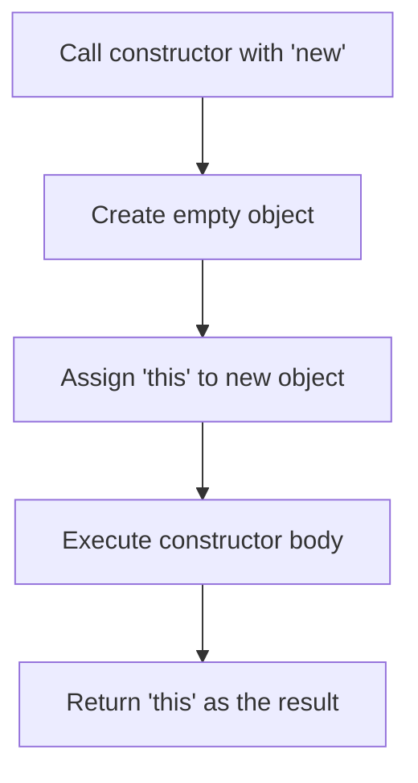

# 🏗️ JavaScript Constructor Functions and the `new` Operator

## 📘 Overview

Constructor functions and the `new` operator allow us to efficiently create multiple similar objects. Instead of duplicating structure every time, we define a reusable "blueprint" with a function.

---

## 🧰 What Is a Constructor Function?

A **constructor function** is a regular function used to **create and initialize** objects.

### ✅ Naming Convention:
- Starts with a **capital letter**.
- Invoked using the **`new` operator**.

### 📦 Example:
```js
function User(name) {
  this.name = name;
  this.isAdmin = false;
}

let user = new User("Jack");

console.log(user.name);    // Jack
console.log(user.isAdmin); // false
````

---

## 🔄 What Happens When You Use `new`?



---

## 🔁 Reusability with Constructors

Once defined, you can easily make multiple similar objects:

```js
let user1 = new User("Ann");
let user2 = new User("Alice");
```

---

## 🧪 One-time Object Creation

Use an immediately invoked constructor function if you're creating a one-time complex object:

```js
let user = new function() {
  this.name = "John";
  this.isAdmin = false;
  // Additional creation logic here
};
```

---

## 🚦 Detecting Constructor Mode with `new.target`

Use `new.target` to check if a function was called using `new`.

```js
function User() {
  console.log(new.target);
}

User();      // undefined
new User();  // function User
```

### 🔁 Make Regular Calls Behave Like `new`:

```js
function User(name) {
  if (!new.target) {
    return new User(name);
  }
  this.name = name;
}

let john = User("John");
console.log(john.name); // John
```

---

## 🧭 Constructor Return Behavior

### 🎁 If `return` returns an object — it replaces `this`:

```js
function BigUser() {
  this.name = "John";
  return { name: "Godzilla" };  // This object is returned
}

console.log(new BigUser().name); // Godzilla
```

### ✋ If it returns a primitive or nothing — `this` is returned:

```js
function SmallUser() {
  this.name = "John";
  return; // returns 'this'
}

console.log(new SmallUser().name); // John
```

---

## 📝 Parentheses with `new`

Valid but not recommended:

```js
let user = new User; // Same as new User()
```

---

## 🔧 Adding Methods in Constructors

You can define methods directly on each object:

```js
function User(name) {
  this.name = name;
  this.sayHi = function() {
    console.log("My name is: " + this.name);
  };
}

let john = new User("John");
john.sayHi(); // My name is: John
```

### 👇 Resulting object:

```js
{
  name: "John",
  sayHi: function() { ... }
}
```

---

## 🧠 Real-World Analogy

A **constructor function** is like a mold in a factory:

* 🏭 The mold = constructor function.
* 🧁 Each product made = object instance.
* `new` = the machine pressing the mold to make a product.

---

## ✅ Summary Table

| Concept                   | Description                                                      |
| ------------------------- | ---------------------------------------------------------------- |
| Constructor Function      | Function used to create object templates                         |
| `new` Operator            | Automates creation and initialization of a new object            |
| `new.target`              | Detects if a function was called with `new`                      |
| Return from Constructor   | Returning object replaces `this`, returning primitive is ignored |
| One-time `new function()` | Used for single complex object creation                          |
| Methods in Constructors   | Define per-object functions during creation                      |

---

## 🔜 What’s Next?

Explore `class` syntax — a more structured and modern way to do what constructors do (and much more).

```


